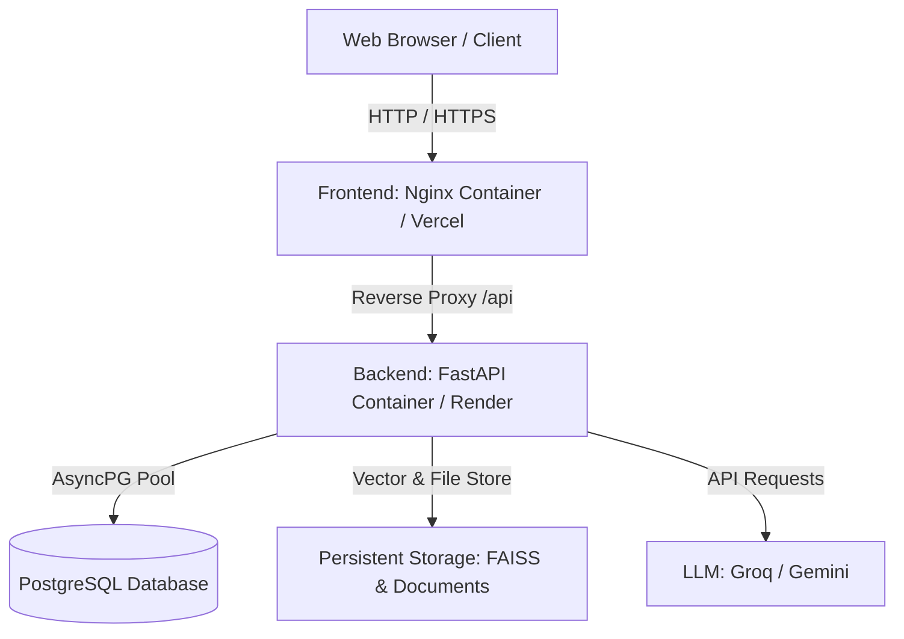

# INDUS AI - Production Deployment Guide

This guide provides step-by-step instructions for deploying the **INDUS AI** Industrial Cognitive Memory System across multiple hosting platforms.

---

## 📑 Table of Contents
1. [Architecture Overview](#architecture-overview)
2. [Option A: Docker Compose Deployment (Recommended)](#option-a-docker-compose-deployment-recommended)
3. [Option B: Cloud PaaS Deployment (Render / Railway)](#option-b-cloud-paas-deployment-render--railway)
4. [Option C: Split Deployment (Vercel + Render/Fly.io + Supabase/Neon)](#option-c-split-deployment-vercel--renderflyio--supabaseneon)
5. [Option D: VPS / Dedicated Server (AWS EC2 / DigitalOcean / Hetzner) with SSL](#option-d-vps--dedicated-server-with-ssl)
6. [Environment Variables Reference](#environment-variables-reference)
7. [Database Migrations & Backup](#database-migrations--backup)
8. [Health Check & Verification](#health-check--verification)

---

## Architecture Overview



---

## Option A: Docker Compose Deployment (Recommended)

This is the fastest and most self-contained method. It sets up PostgreSQL, FastAPI Backend, and React Frontend in isolated, communicating containers with persistent storage.

### 1. Prerequisites
- [Docker](https://docs.docker.com/get-docker/) (v24.0+)
- [Docker Compose](https://docs.docker.com/compose/install/) (v2.0+)

### 2. Configuration
In the project root directory (`INDUS AI`):
```bash
# 1. Create .env from template
cp .env.production.example .env

# 2. Edit .env with your production credentials
# Set strong passwords, your SECRET_KEY, and your LLM API keys (GROQ_API_KEY / GEMINI_API_KEY)
```

### 3. Launch the Stack
```bash
# Build and start all containers in detached mode
docker compose up -d --build

# View logs to ensure all services are healthy
docker compose logs -f
```

### 4. Apply Database Migrations (First-time initialization)
```bash
docker compose exec backend python scripts/upgrade_database.py
```

### 5. Access the Application
- **Frontend UI**: `http://localhost` (or `http://YOUR_SERVER_IP`)
- **Backend API**: `http://localhost:8000` (or proxied at `http://YOUR_SERVER_IP/api`)
- **API Docs**: `http://localhost:8000/docs`

---

## Option B: Cloud PaaS Deployment (Render / Railway)

### 1. Railway Deployment
1. Connect your GitHub repository to [Railway](https://railway.app/).
2. Add a **PostgreSQL** service from Railway templates.
3. Add a **Backend Service**:
   - Set Root Directory: `backend`
   - Set Start Command: `uvicorn app.main:app --host 0.0.0.0 --port $PORT`
   - Add environment variables (`DATABASE_URL`, `SECRET_KEY`, `GROQ_API_KEY`, `APP_ENV=production`).
4. Add a **Frontend Service**:
   - Set Root Directory: `frontend`
   - Set Build Command: `npm run build`
   - Set Environment Variable: `VITE_API_URL=https://your-backend-railway-url.up.railway.app`

### 2. Render Deployment
1. Create a **PostgreSQL Database** on [Render](https://render.com/).
2. Create a **Web Service** for Backend:
   - Environment: `Python 3`
   - Root Directory: `backend`
   - Build Command: `pip install -r requirements.txt`
   - Start Command: `uvicorn app.main:app --host 0.0.0.0 --port $PORT`
   - Connect PostgreSQL `DATABASE_URL` and add `SECRET_KEY`, `GROQ_API_KEY`.
3. Create a **Static Site** for Frontend:
   - Root Directory: `frontend`
   - Build Command: `npm install && npm run build`
   - Publish Directory: `dist`
   - Environment Variable: `VITE_API_URL=https://your-backend.onrender.com`
   - Rewrite rule for SPA: `/* -> /index.html (Rewrite 200)`

---

## Option C: Split Deployment (Vercel + Render + Supabase)

### 1. Database (Supabase / Neon)
- Create a free PostgreSQL instance on [Supabase](https://supabase.com) or [Neon](https://neon.tech).
- Obtain the connection string (use the Session/Direct pooling URL with `postgresql+asyncpg://`).

### 2. Backend (Render / Fly.io)
- Deploy the `backend/` folder to Render or Fly.io with your database connection string and secrets.

### 3. Frontend (Vercel)
- Import the repo into [Vercel](https://vercel.com).
- Set Root Directory to `frontend`.
- Add Environment Variable `VITE_API_URL=https://your-deployed-backend-url.com`.
- Deploy!

---

## Option D: VPS / Dedicated Server with SSL (Ubuntu 22.04 / 24.04)

### 1. Setup Server & Firewall
```bash
sudo apt update && sudo apt upgrade -y
sudo apt install -y docker.io docker-compose-v2 git ufw certbot python3-certbot-nginx

# Configure firewall
sudo ufw allow 22/tcp
sudo ufw allow 80/tcp
sudo ufw allow 443/tcp
sudo ufw enable
```

### 2. Clone Repository & Start Containers
```bash
git clone <your-repo-url> /opt/indus-ai
cd /opt/indus-ai
cp .env.production.example .env
# Edit .env with production credentials
nano .env

# Start docker compose
docker compose up -d --build
```

### 3. Set up Nginx Reverse Proxy with HTTPS (Certbot)
Create `/etc/nginx/sites-available/indus-ai`:
```nginx
server {
    server_name indus.yourdomain.com;

    location / {
        proxy_pass http://127.0.0.1:80;
        proxy_set_header Host $host;
        proxy_set_header X-Real-IP $remote_addr;
        proxy_set_header X-Forwarded-For $proxy_add_x_forwarded_for;
        proxy_set_header X-Forwarded-Proto $scheme;
    }
}
```
Enable site and obtain SSL:
```bash
sudo ln -s /etc/nginx/sites-available/indus-ai /etc/nginx/sites-enabled/
sudo certbot --nginx -d indus.yourdomain.com
```

---

## Environment Variables Reference

| Variable | Required | Default | Description |
| :--- | :--- | :--- | :--- |
| `APP_ENV` | Yes | `production` | Environment mode (`development` / `production`) |
| `DB_HOST` | Yes | `db` / `localhost` | PostgreSQL host |
| `DB_PORT` | Yes | `5432` | PostgreSQL port |
| `DB_NAME` | Yes | `indus_ai` | Database name |
| `DB_USER` | Yes | `postgres` | Database user |
| `DB_PASSWORD` | Yes | — | Database password |
| `DATABASE_URL` | Optional | Auto-constructed | Full PostgreSQL AsyncPG connection URL |
| `SECRET_KEY` | Yes | — | Secret key for JWT encryption |
| `ALGORITHM` | Yes | `HS256` | JWT signing algorithm |
| `ACCESS_TOKEN_EXPIRE_MINUTES` | Yes | `1440` | Session expiration in minutes (default 24h) |
| `LLM_PROVIDER` | Yes | `groq` | Chosen AI model provider (`groq` or `gemini`) |
| `GROQ_API_KEY` | If using Groq | — | Groq Cloud API Key |
| `GEMINI_API_KEY` | If using Gemini | — | Google Gemini API Key |
| `VITE_API_URL` | Optional | `""` | Backend API URL for frontend |

---

## Database Migrations & Backup

### Apply Migrations
```bash
# In Docker:
docker compose exec backend python scripts/upgrade_database.py

# In Local / Bare-metal:
cd backend && python scripts/upgrade_database.py
```

### Database Backup
```bash
# Automated dump
docker compose exec -T db pg_dump -U postgres indus_ai > backup_$(date +%Y%m%d_%H%M%S).sql

# Restore dump
cat backup.sql | docker compose exec -T db psql -U postgres -d indus_ai
```

---

## Health Check & Verification

Once deployed, verify system status:
1. **API Health**: `curl https://your-domain.com/health` or `http://localhost:8000/health`
   Expected response:
   ```json
   {
     "status": "healthy",
     "database": "connected",
     "environment": "production",
     "version": "1.0.0"
   }
   ```
2. **Frontend UI**: Open `https://your-domain.com` in your browser and check login/dashboard.
